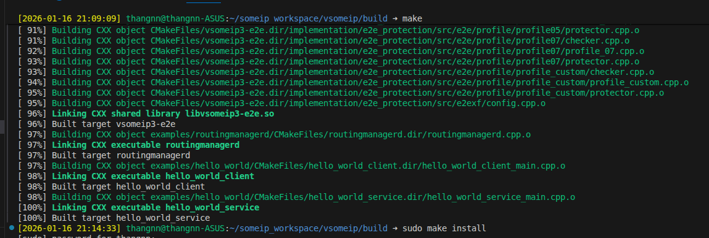
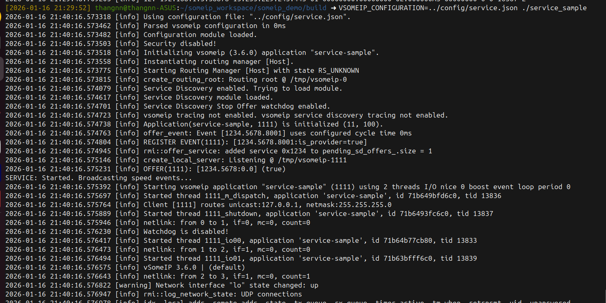
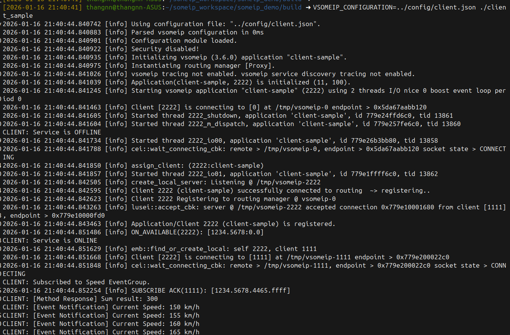
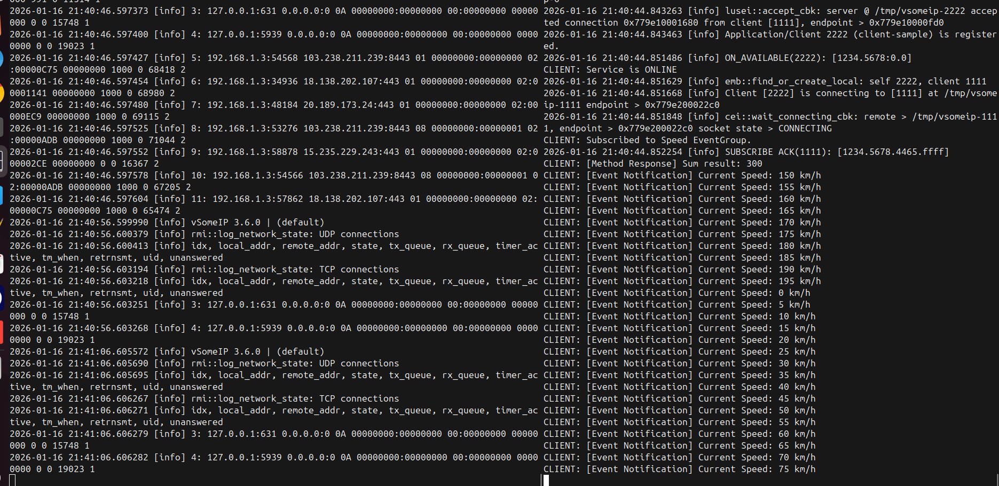

Bước 5: Build và Chạy
Build lại:

Bash

cd ~/someip_workspace/someip_demo/build
make
Lưu ý: cmake không cần chạy lại nếu bạn không sửa CMakeLists.txt. Nếu báo lỗi thiếu file .hpp, hãy kiểm tra xem bạn đã đặt payload_helper.hpp đúng trong thư mục src/ chưa.

Chạy Service (Terminal 1):

Bash

export LD_LIBRARY_PATH=/usr/local/lib:$LD_LIBRARY_PATH
VSOMEIP_CONFIGURATION=../config/service.json ./service_sample

Chạy Client (Terminal 2):

Bash

export LD_LIBRARY_PATH=/usr/local/lib:$LD_LIBRARY_PATH
VSOMEIP_CONFIGURATION=../config/client.json ./client_sample

