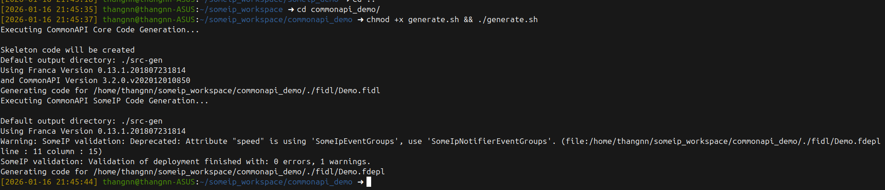
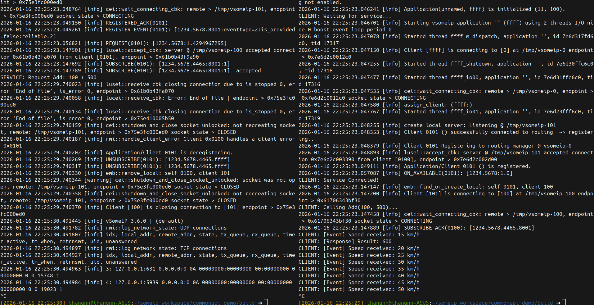

Bước 0: Chuẩn bị môi trường (Khá nặng)
CommonAPI cần 2 thư viện Runtime (Core + Binding) và Java để chạy Generator.

1. Cài đặt Java (Để chạy tool sinh code)

Bash

sudo apt install default-jre
2. Tải và Build thư viện CommonAPI Chúng ta cần build commonapi-core và commonapi-someip-binding.

Bash

cd ~/someip_workspace
# 1. CommonAPI Core
git clone https://github.com/COVESA/capicxx-core-runtime.git
cd capicxx-core-runtime
mkdir build && cd build
cmake ..
make
sudo make install

# 2. CommonAPI SOME/IP Runtime (Cầu nối với vsomeip)
cd ~/someip_workspace
git clone https://github.com/COVESA/capicxx-someip-runtime.git
cd capicxx-someip-runtime
mkdir build && cd build
cmake ..
make
sudo make install
3. Tải Tool sinh code (Code Generators) Bạn không cần build cái này, tải file chạy (.zip) về là được. Tôi sẽ tạo thư mục generators.

Bash

cd ~/someip_workspace
mkdir generators && cd generators

# Tải Core Generator
wget https://github.com/COVESA/capicxx-core-tools/releases/download/3.2.0.1/commonapi_core_generator.zip
unzip commonapi_core_generator.zip -d commonapi-core-generator

# Tải SOME/IP Generator
wget https://github.com/COVESA/capicxx-someip-tools/releases/download/3.2.0.1/commonapi_someip_generator.zip
unzip commonapi_someip_generator.zip -d commonapi-someip-generator
Bước 1: Thiết kế Giao diện (Franca IDL)
Thay vì #define ID, chúng ta viết file mô tả .fidl. Tạo thư mục fidl trong project mới commonapi_demo.

File: fidl/Demo.fidl

Java

package commonapi.demo

interface DemoService {
    version { major 1 minor 0 }

    // 1. Method: Cộng số (Request/Response)
    method add {
        in {
            UInt32 num1
            UInt32 num2
        }
        out {
            UInt32 result
        }
    }

    // 2. Attribute: Tốc độ (Event/Observable)
    // readonly = client chỉ đọc, không ghi được
    attribute UInt32 speed readonly
}
Bước 2: Cấu hình Triển khai (Deployment - FDEPL)
File này ánh xạ từ tên hàm trong IDL sang ID số của SOME/IP (1234, 5678...).

File: fidl/Demo.fdepl

Java

import "platform:/plugin/org.genivi.commonapi.someip/deployment/CommonAPI-SOMEIP_deployment_spec.fdepl"
import "Demo.fidl"

define org.genivi.commonapi.someip.deployment for interface commonapi.demo.DemoService {
    SomeIpServiceID = 0x1234

    method add {
        SomeIpMethodID = 0x0001
    }

    attribute speed {
        SomeIpGetterID = 0x3000
        SomeIpNotifierID = 0x8001 // Event ID
        SomeIpEventGroups = { 0x4465 } // Event Group ID
    }
}

define org.genivi.commonapi.someip.deployment for provider as MyService {
    instance commonapi.demo.DemoService {
        InstanceId = "commonapi.demo.DemoService" // Tên instance logic
        SomeIpInstanceID = 0x5678
    }
}
Bước 3: Sinh Code (Generate Code)
Tạo script để máy tự viết code C++ cho bạn.

File: generate.sh

Bash

#!/bin/bash
CORE_GEN=~/someip_workspace/generators/commonapi-core-generator/commonapi-core-generator-linux-x86_64
SOMEIP_GEN=~/someip_workspace/generators/commonapi-someip-generator/commonapi-someip-generator-linux-x86_64

# Sinh code Core (Proxy, Stub, Types)
$CORE_GEN -sk ./fidl/Demo.fidl -d ./src-gen

# Sinh code Binding (Glue code kết nối vsomeip)
$SOMEIP_GEN ./fidl/Demo.fdepl -d ./src-gen
Chạy lệnh: chmod +x generate.sh && ./generate.sh. Bạn sẽ thấy thư mục src-gen xuất hiện hàng tá file .cpp và .hpp. Đừng sửa file trong này!

Bước 4: Viết Code Service (Implementation)
Bây giờ bạn chỉ cần kế thừa class DemoServiceStubDefault mà tool vừa sinh ra.

File: src/Service.cpp

C++

#include <iostream>
#include <thread>
#include <CommonAPI/CommonAPI.hpp>
#include "v1/commonapi/demo/DemoServiceStubDefault.hpp"

// Kế thừa Stub mặc định
class DemoServiceStubImpl : public v1::commonapi::demo::DemoServiceStubDefault {
public:
    DemoServiceStubImpl() = default;

    // 1. Implement hàm Add (Dễ hơn raw vsomeip rất nhiều!)
    virtual void add(const std::shared_ptr<CommonAPI::ClientId> _client, 
                     uint32_t _num1, uint32_t _num2, addReply_t _reply) override {
        
        std::cout << "SERVICE: Request Add: " << _num1 << " + " << _num2 << std::endl;
        // Gửi phản hồi
        _reply(_num1 + _num2);
    }
};

void run_speedometer(std::shared_ptr<DemoServiceStubImpl> service) {
    uint32_t speed = 0;
    while(true) {
        speed = (speed + 5) % 200;
        // Bắn Event: Chỉ cần setAttribute, CommonAPI tự lo việc notify
        service->setSpeedAttribute(speed); 
        std::this_thread::sleep_for(std::chrono::seconds(1));
    }
}

int main() {
    // Khởi tạo CommonAPI Runtime
    std::shared_ptr<CommonAPI::Runtime> runtime = CommonAPI::Runtime::get();

    // Khởi tạo Service của mình
    std::shared_ptr<DemoServiceStubImpl> myService = std::make_shared<DemoServiceStubImpl>();

    // Đăng ký Service với tên "local:commonapi.demo.DemoService:commonapi.demo.DemoService"
    // (Format: local:<Interface>:<Instance>)
    runtime->registerService("local", "commonapi.demo.DemoService:commonapi.demo.DemoService", myService);

    std::cout << "SERVICE: Ready!" << std::endl;

    std::thread t(run_speedometer, myService);
    t.join();
}
Bước 5: Viết Code Client
Client sử dụng Proxy để gọi hàm.

File: src/Client.cpp

C++

#include <iostream>
#include <thread>
#include <CommonAPI/CommonAPI.hpp>
#include "v1/commonapi/demo/DemoServiceProxy.hpp"

using namespace v1::commonapi::demo;

int main() {
    std::shared_ptr<CommonAPI::Runtime> runtime = CommonAPI::Runtime::get();

    // Tạo Proxy để nói chuyện với Service
    std::shared_ptr<DemoServiceProxy<>> myProxy = 
        runtime->buildProxy<DemoServiceProxy>("local", "commonapi.demo.DemoService:commonapi.demo.DemoService");

    // Đợi kết nối
    std::cout << "CLIENT: Waiting for service..." << std::endl;
    while (!myProxy->isAvailable()) {
        std::this_thread::sleep_for(std::chrono::milliseconds(100));
    }
    std::cout << "CLIENT: Service Connected!" << std::endl;

    // 1. Đăng ký nhận Event Tốc độ
    myProxy->getSpeedAttribute().getChangedEvent().subscribe([&](const uint32_t& val) {
        std::cout << "CLIENT: [Event] Speed received: " << val << " km/h" << std::endl;
    });

    // 2. Gọi hàm Add (Synchronous - gọi xong chờ kết quả luôn cho gọn)
    CommonAPI::CallStatus callStatus;
    uint32_t result;
    uint32_t n1 = 100, n2 = 500;

    std::cout << "CLIENT: Calling Add(100, 500)..." << std::endl;
    myProxy->add(n1, n2, callStatus, result);

    if (callStatus == CommonAPI::CallStatus::SUCCESS) {
        std::cout << "CLIENT: [Response] Result: " << result << std::endl;
    } else {
        std::cout << "CLIENT: Call failed!" << std::endl;
    }

    // Giữ chương trình chạy để nhận Event
    while (true) { std::this_thread::sleep_for(std::chrono::seconds(1)); }
}
Bước 6: File CMake (Phức tạp hơn)
CommonAPI cần link với nhiều thư viện hơn.

File: CMakeLists.txt

CMake

cmake_minimum_required(VERSION 3.0)
project(commonapi_demo)

find_package(CommonAPI 3.2 REQUIRED)
find_package(CommonAPI-SomeIP 3.2 REQUIRED)
find_package(vsomeip3 3.1.20 REQUIRED)

include_directories(
    src
    src-gen
)

# Gom code sinh tự động
file(GLOB GEN_SRCS "src-gen/v1/commonapi/demo/*.cpp")

# Build Service
add_executable(service src/Service.cpp ${GEN_SRCS})
target_link_libraries(service CommonAPI CommonAPI-SomeIP vsomeip3 pthread)

# Build Client
add_executable(client src/Client.cpp ${GEN_SRCS})
target_link_libraries(client CommonAPI CommonAPI-SomeIP vsomeip3 pthread)
Bước 7: Cấu hình commonapi.ini
Thay vì chỉ file json, bạn cần file .ini để map giữa "Instance Name" trong code và file cấu hình vsomeip.

Tạo file commonapi.ini:

Ini, TOML

[default]
binding=someip

[logging]
console=true
file=./commonapi.log
level=info

[proxy]
local:commonapi.demo.DemoService:commonapi.demo.DemoService=commonapi.demo.DemoService

[stub]
local:commonapi.demo.DemoService:commonapi.demo.DemoService=commonapi.demo.DemoService
Và bạn vẫn cần file service.json (giống bài trước) nhưng đặt tên instance trong file json phải khớp với file .fdepl.

Tổng kết
Chạy generate.sh để sinh code từ FIDL.

Make project.

Chạy: COMMONAPI_CONFIG=../commonapi.ini VSOMEIP_CONFIGURATION=../service.json ./service

Bạn sẽ thấy code C++ của mình cực kỳ sạch sẽ, không còn chút bóng dáng nào của việc đóng gói byte hay xử lý socket. Đó là đẳng cấp của CommonAPI.

===========================================================================

Bước 2: Chạy Service (Server)
Mở Terminal 1, di chuyển vào thư mục build và chạy lệnh sau:

Bash

cd ~/someip_workspace/commonapi_demo/build

# 1. Load thư viện động (để máy tìm thấy libCommonAPI.so)
export LD_LIBRARY_PATH=/usr/local/lib:$LD_LIBRARY_PATH

# 2. Chạy Service với 2 biến môi trường cấu hình
COMMONAPI_CONFIG=../commonapi.ini VSOMEIP_CONFIGURATION=../config/service.json ./service
👉 Dấu hiệu thành công: Bạn sẽ thấy dòng chữ SERVICE: Ready! và chương trình đứng im chờ đợi.

Bước 3: Chạy Client
Mở Terminal 2, cũng vào thư mục build và chạy:

Bash

cd ~/someip_workspace/commonapi_demo/build

export LD_LIBRARY_PATH=/usr/local/lib:$LD_LIBRARY_PATH

COMMONAPI_CONFIG=../commonapi.ini VSOMEIP_CONFIGURATION=../config/service.json ./client

