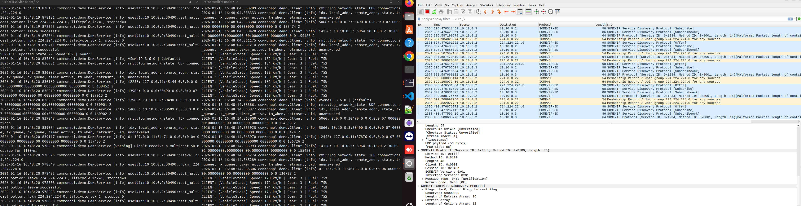

[2026-01-16 22:44:57] thangnn@thangnn-ASUS:~/someip_workspace/commonapi_demo ➜ docker compose up -d
[+] up 3/3
 ✔ Network commonapi_demo_someip-net Created                                                                                                                                    0.0s 
 ✔ Container someip-service          Created                                                                                                                                    0.0s 
 ✔ Container someip-client           Created                                                                                                                                    0.0s 
[2026-01-16 22:45:28] thangnn@thangnn-ASUS:~/someip_workspace/commonapi_demo ➜ docker compose down
[+] down 2/3
 ✔ Container someip-client           Removed                                                                                                                                   11.2s 
 ✔ Container someip-service          Removed                                                                                                                                   11.3s 
 ⠋ Network commonapi_demo_someip-net Removing                                                                                                                                   0.0s 
[2026-01-16 23:21:25] thangnn@thangnn-ASUS:~/someip_workspace/commonapi_demo ➜ docker compose up -d
[+] up 3/3
 ✔ Network commonapi_demo_someip-net Created                                                                                                                                    0.0s 
 ✔ Container someip-client           Created                                                                                                                                    0.0s 
 ✔ Container someip-service          Created                                                                                                                                    0.0s 
[2026-01-16 23:21:55] thangnn@thangnn-ASUS:~/someip_workspace/commonapi_demo ➜ 

Bước 1: Cài đặt lại thư viện và công cụ (Làm cả 2 bên)
Tại mỗi Terminal (đã chui vào Docker), hãy chạy lệnh này:

Bash

apt update
# Cài đặt route (net-tools) và thư viện Boost bị thiếu
apt install -y net-tools libboost-all-dev
Bước 2: Thiết lập Route (Làm cả 2 bên)
Sau khi cài xong net-tools, lệnh route sẽ hoạt động. Bạn hãy chạy:

Bash

# Lệnh này bây giờ sẽ chạy được nhờ quyền NET_ADMIN đã thêm vào compose
route add -net 224.0.0.0 netmask 240.0.0.0 dev eth0
Bước 3: Chạy ứng dụng
Bây giờ bạn hãy chạy lại lệnh khởi động. Lưu ý: Tôi đã bổ sung thêm biến PATH vào lệnh env -i để hệ thống không bị "ngơ" khi tìm lệnh.

Tại Terminal Service (Server):

Bash
docker exec -it someip-service bash
env -i PATH=/usr/local/sbin:/usr/local/bin:/usr/sbin:/usr/bin:/sbin:/bin \
LD_LIBRARY_PATH=/usr/local/lib \
VSOMEIP_CONFIGURATION=/app/config_docker/service.json \
VSOMEIP_APPLICATION_NAME=commonapi.demo.DemoService \
COMMONAPI_CONFIG=/app/commonapi.ini \
/app/build/service
Tại Terminal Client:

Bash
docker exec -it someip-client bash
env -i PATH=/usr/local/sbin:/usr/local/bin:/usr/sbin:/usr/bin:/sbin:/bin \
LD_LIBRARY_PATH=/usr/local/lib \
VSOMEIP_CONFIGURATION=/app/config_docker/client.json \
VSOMEIP_APPLICATION_NAME=commonapi.demo.Client \
COMMONAPI_CONFIG=/app/commonapi.ini \
/app/build/client

Bước 1: Cập nhật docker-compose.yml
Bạn hãy mở file docker-compose.yml trên máy thật và thêm dòng cap_add: - NET_ADMIN vào cả hai dịch vụ như sau:

YAML

services:
  service-node:
    # ... các cấu hình cũ ...
    cap_add:
      - NET_ADMIN  # <--- Thêm dòng này
    networks:
      someip-net:
        ipv4_address: 10.10.0.2

  client-node:
    # ... các cấu hình cũ ...
    cap_add:
      - NET_ADMIN  # <--- Thêm dòng này
    networks:
      someip-net:
        ipv4_address: 10.10.0.3
Bước 2: Khởi động lại Docker
Để áp dụng quyền mới, bạn cần khởi động lại hoàn toàn các container:

Bash

docker compose down
docker compose up -d
Bước 3: Thực hiện lại lệnh route add
Bây giờ bạn hãy chui lại vào từng container và chạy lệnh thêm route. Lúc này lệnh sẽ thành công mà không báo lỗi nữa:

Trong Terminal của cả Service và Client:

Bash

# Chui vào container (ví dụ service)
docker exec -it someip-service bash

# Chạy lệnh (lần này sẽ OK)
route add -net 224.0.0.0 netmask 240.0.0.0 dev eth0